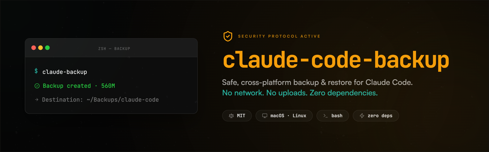

<p align="center">
  
</p>

<p align="center">
  <a href="LICENSE"></a>
  
  
  
</p>

# claude-code-backup

Safe, cross-platform backup & restore for [Claude Code](https://claude.com/claude-code).
It snapshots your global and per-project config — settings, MCP, slash commands,
agents, hooks, skills, and conversation history — into a single `.tar.gz` you
control, and restores it on the same or a new machine.

- Pure `bash` + `tar`/`gzip` — **no** `jq`, Python, Node or Homebrew.
- **macOS & Linux** (works under macOS's system bash 3.2).
- **No network, no uploads, no telemetry.** Works even without Claude Code installed.

## Install

One-liner (downloads sources, installs to `~/.local`):

```bash
curl -fsSL https://raw.githubusercontent.com/dberuben/claude-code-backup/main/install.sh | bash
```

Or from a checkout:

```bash
git clone https://github.com/dberuben/claude-code-backup.git
cd claude-code-backup
./install.sh                       # → ~/.local  (use --prefix to change)
```

Make sure `~/.local/bin` is on your `PATH`, then check your setup:

```bash
claude-backup doctor
```

## Use

```bash
claude-backup                      # back up → ~/Backups/claude-code
claude-backup --dry-run            # preview only, writes nothing
claude-backup list                 # list existing backups
claude-backup verify               # check the latest archive (gzip + checksum)
claude-restore                     # restore the latest backup (asks first)
```

Handy flags: `--no-history` (skip the large `projects/` history), `--full`
(everything), `--no-project`, `--dest <dir>`, `--strict-secrets`, `--json`.
Full reference: `claude-backup --help`.

Every backup writes a `<archive>.sha256` sidecar; `claude-backup verify`
re-checks the gzip stream, the checksum and the path safety of an archive.

### Off-site copy (opt-in)

Backups are local by default. Push them anywhere with a command of your choice —
`{}` is replaced by the archive path (no extra dependency required):

```bash
claude-backup --remote 'cmd:rclone copy {} mydrive:claude/'
claude-backup --remote 'cmd:rsync -a {} nas:/backups/'
claude-backup push --remote 'cmd:aws s3 cp {} s3://bucket/claude/'   # push the latest
```

Set `CLAUDE_BACKUP_REMOTE` to make it the default. A failed push never deletes
the local backup.

### Schedule it

```bash
claude-backup schedule --daily --at 02:30          # launchd / systemd timer / cron
claude-backup schedule --status
claude-backup unschedule
```

Pass options to each scheduled run after `--`, e.g.
`schedule --daily -- --no-history --remote 'cmd:rclone copy {} d:/'`.

### Restore a subset

```bash
claude-restore --list-contents                 # what's inside an archive
claude-restore --only agents,commands          # restore just those
claude-restore --only settings --home-only
```

Categories: `settings agents commands hooks skills mcp claude-md history plugins`.

By default a backup includes your config **and** conversation history, but
**prunes** big regenerable data (plugin code, caches, venvs). Plugin *code* is
not stored — the install manifests are, so you know what to reinstall.

## New machine

```bash
git clone https://github.com/dberuben/claude-code-backup.git
cd claude-code-backup && ./install.sh
claude-restore
```

Restore validates the archive, shows a plan, asks to confirm, and takes a
pre-restore backup first. Some credentials (Keychain / OAuth / env vars) may
need re-login afterwards. Details: [docs/restore-safety.md](docs/restore-safety.md).

## Claude Code plugin (optional)

```text
/plugin marketplace add https://github.com/dberuben/claude-code-backup
/plugin install claude-code-backup@claude-code-backup
```

Adds `/backup`, `/restore`, `/backup-status`, `/backup-doctor`. It's a thin
layer over the CLI — the CLI works fine on its own. See [docs/plugin.md](docs/plugin.md).

## Security

Backups can contain secrets (tokens, API keys, MCP auth, private instructions).
**Never commit them to git** (the repo ignores `*.tar.gz`) and store them
encrypted. A heuristic scanner warns about likely secrets; `--strict-secrets`
turns the warning into a hard stop. Full guidance: [SECURITY.md](SECURITY.md).

## Status banner (optional)

```bash
claude-backup-banner               # compact project / backup status line
```

Configure via `~/.claude-backup/banner.conf` — see [docs/banner.md](docs/banner.md).

## More

[Architecture](docs/architecture.md) · [Restore safety](docs/restore-safety.md)
· [Banner](docs/banner.md) · [Plugin](docs/plugin.md) ·
[Contributing](CONTRIBUTING.md) · [Changelog](CHANGELOG.md)

## License

[MIT](LICENSE) © claude-code-backup contributors.
